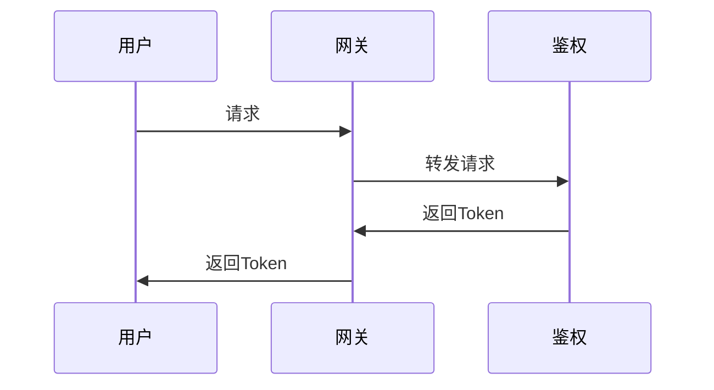
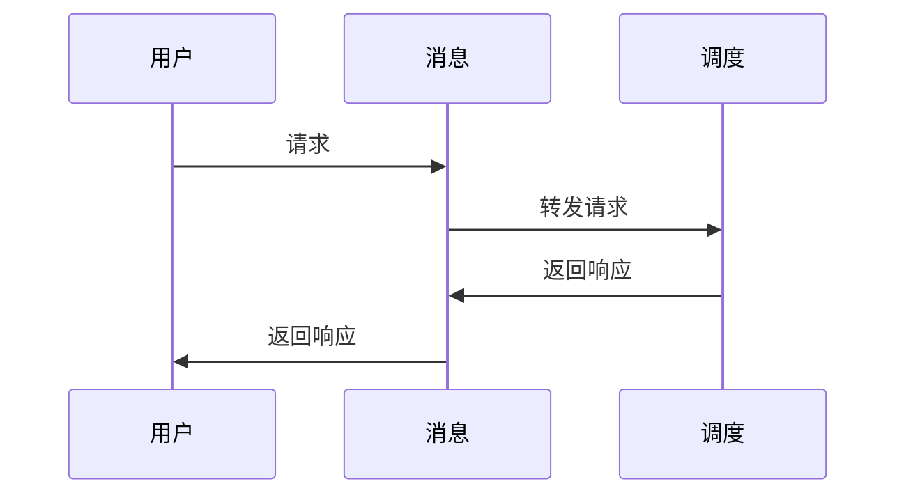

# 安装必要的插件包
    
```shell
# 二选一
$ go install github.com/golang/protobuf/protoc-gen-go@latest // 支持标准库

$ go install github.com/rpcxio/protoc-gen-rpcx@latest
```

# proto协议生成

```shell
$ sh scripts/build_proto.sh user/group/chat
```


# 证书

```shell
# 生成证书
$ sh scripts/build_ssl.sh 证书名称 证书目录

# eg:
$ sh scripts/build_ssl.sh server tls


# 注意：因为使用到的quic协议，有非常严格的证书要求，所以需要修改配置文件进行配置
$ vim server.conf
[ req ]
default_bits       = 4096
distinguished_name = req_distinguished_name
req_extensions     = req_ext
x509_extensions    = v3_ca # The extensions to add to the self-signed cert

[ req_distinguished_name ]
countryName                 = Country Name (2 letter code)
countryName_default         = CN
stateOrProvinceName         = State or Province Name (full name)
stateOrProvinceName_default = GD
localityName                = Locality Name (eg, city)
localityName_default        = SZ
organizationName            = Organization Name (eg, company)
organizationName_default    = Acme, Inc.
commonName                  = Common Name (eg, fully qualified host name)
commonName_default          = 127.0.0.1 # 此处需要修改

[ req_ext ]
subjectAltName = @alt_names

[ v3_ca ]
subjectAltName = @alt_names
basicConstraints = critical, CA:TRUE

[ alt_names ] 
IP.1   = 127.0.0.1 # 此处需要修改
IP.1   = 10.213.11.10 # 此处需要修改

# 还可以用域名
DNS.1  = test.com # 此处需要修改

```


# 模块

## gateway 网关

## Messaging 消息

## dispatch 调度

# 核心流程时序图

# 用户访问全周期图
1. 用户 -> 网关 -> [鉴权(token)] -> messaging的tcp端口 -> 用户
2. 用户[token]-> messaging，messaging鉴权后,开始接受和发送消息
消息发送到dispatch，dispatch根据消息类型，分发到不同的服务

## 用户访问网关


## 用户访问消息
