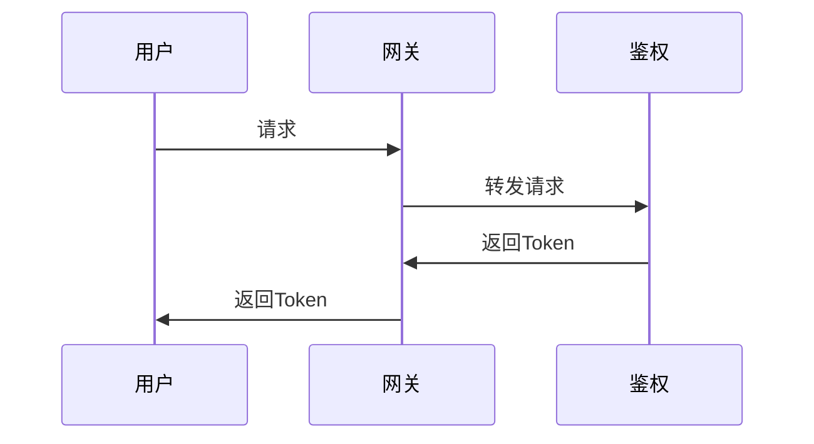
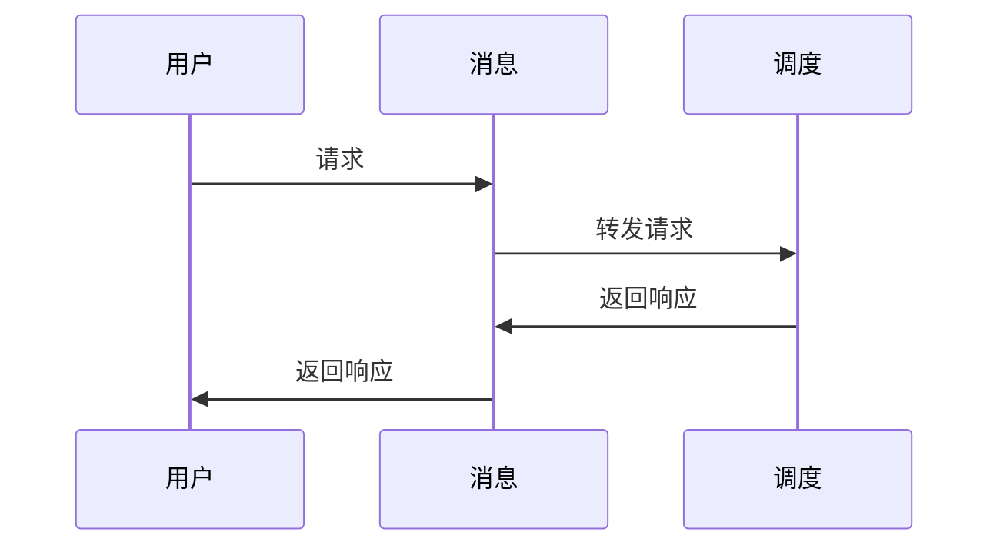

# 安装必要的插件包
    
    ```shell
    # 二选一
    go install github.com/golang/protobuf/protoc-gen-go@latest // 支持标准库
    
    go install github.com/rpcxio/protoc-gen-rpcx@latest
    ```

# proto协议生成

    ```shell
    sh scripts/build_proto.sh user/group/chat
    ```


# 模块

## gateway 网关

## Messaging 消息

## dispatch 调度

# 核心流程时序图

# 用户访问全周期图
1. 用户 -> 网关 -> [鉴权(token)] -> messaging的tcp端口 -> 用户
2. 用户[token]-> messaging，messaging鉴权后,开始接受和发送消息
消息发送到dispatch，dispatch根据消息类型，分发到不同的服务

## 用户访问网关


## 用户访问消息
