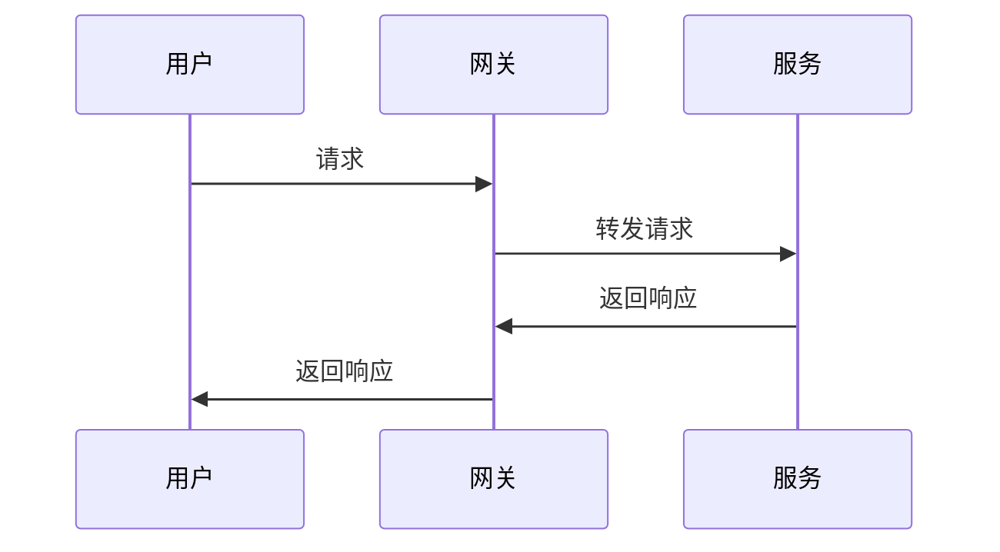

# 网关服务

## 功能
- 路由转发
- 权限校验
- 限流
- 熔断
- 监控
- 日志和监控
- 请求聚合
- 心跳检测

## 用户访问流程

```mermaid
sequenceDiagram
    participant U as 用户
    participant G as 网关
    participant S as 服务
    U->>G: 请求
    G->>S: 转发请求
    S->>G: 返回响应
    G->>U: 返回响应
```
···